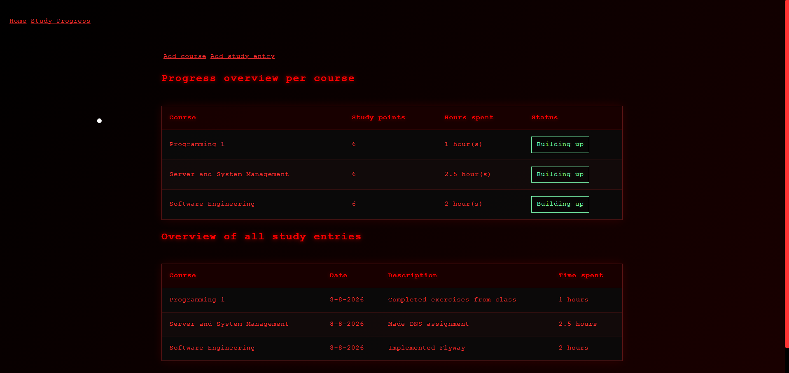

# DevTrack

> A full-stack study management platform built with Spring Boot and Next.js to set target study points, track learning hours, and visualize progress.



## Features

- **Course Management:** Define courses and set target study points.
- **Activity Logging:** Log study entries complete with descriptions, date, and hours spent.
- **Progress Tracking:** Interactive dashboard calculating course completion percentages and statuses.
- **Security & Persistence:** Configured with Spring Security and Spring Data JPA.

## Tech Stack

- **Frontend:** Next.js, React, TypeScript, Plain CSS
- **Backend:** Java 21, Spring Boot, Spring Data JPA, Spring Security
- **Database:** PostgreSQL (Production), H2 (Local Development)

## Project Structure

```text
.
├── Backend/          # Spring Boot REST API & persistence layer
├── Frontend/         # Next.js frontend application
└── scripts/          # Deployment and build scripts
```

## Prerequisites

- Java 21+
- Node.js 20+ & npm
- Maven 3.8+
- PostgreSQL (Optional for production setup; H2 supported for local development)

## Getting Started

### 1. Database & Environment Setup

By default, the backend runs with an in-memory H2 database for rapid local development.

To use PostgreSQL, set the following environment variables:

```bash
export DATABASE_URL=jdbc:postgresql://localhost:5432/devtrack
export DATABASE_USERNAME=your_username
export DATABASE_PASSWORD=your_password
```

### 2. Backend Setup

```bash
cd Backend
mvn spring-boot:run
```

The API server runs on `http://localhost:8080`.

### 3. Frontend Setup

```bash
cd Frontend/devtrack
npm install
npm run dev
```

The web app runs on `http://localhost:3000`.

## API Documentation

### Courses

| Method | Endpoint             | Description                            |
| :----- | :------------------- | :------------------------------------- |
| `GET`  | `/courses`           | Retrieve all courses and logged totals |
| `POST` | `/courses/addCourse` | Add a new course                       |

### Study Entries

| Method | Endpoint                       | Description                      |
| :----- | :----------------------------- | :------------------------------- |
| `GET`  | `/study_entries`               | Retrieve all recorded study logs |
| `POST` | `/study_entries/addStudyEntry` | Log a new study activity         |

## Data Model

- **Course:** `id`, `name`, `study_points`, `studyEntries`
- **StudyEntry:** `id`, `description`, `timeSpent`, `date`, `course`

## Deployment

The project includes custom bash scripts in the `scripts/` directory to automate deployment and infrastructure updates:

- Automatically pulls the latest code updates from GitHub.
- Rebuilds and restarts the application services.

To run the deployment script:

```bash
./scripts/deploy.sh
```

## Testing

Run unit and integration tests across both layers:

```bash
# Backend tests
cd Backend
mvn test

# Frontend tests (coming soon)
cd Frontend/devtrack
npm run test
```
